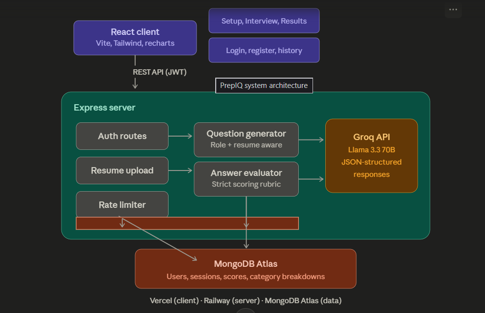
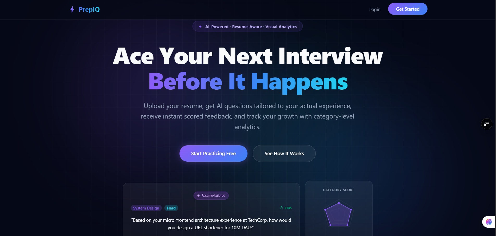
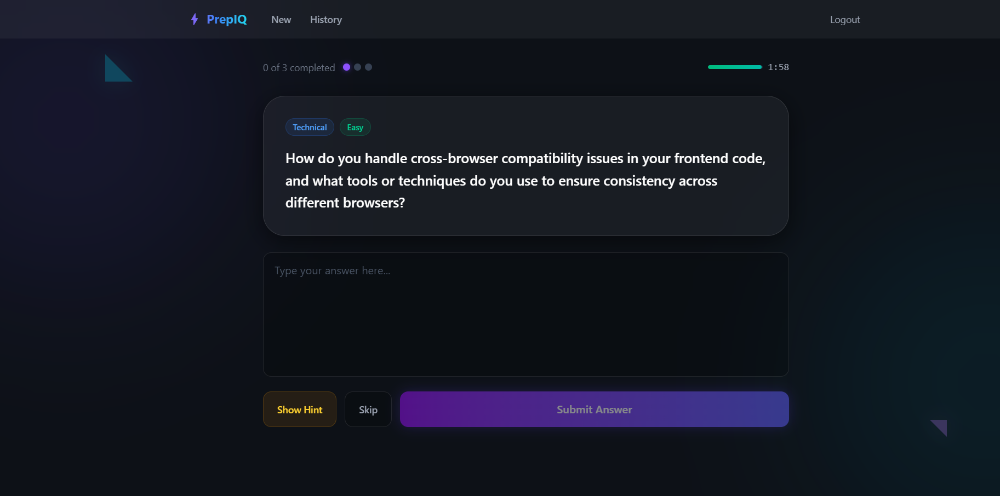
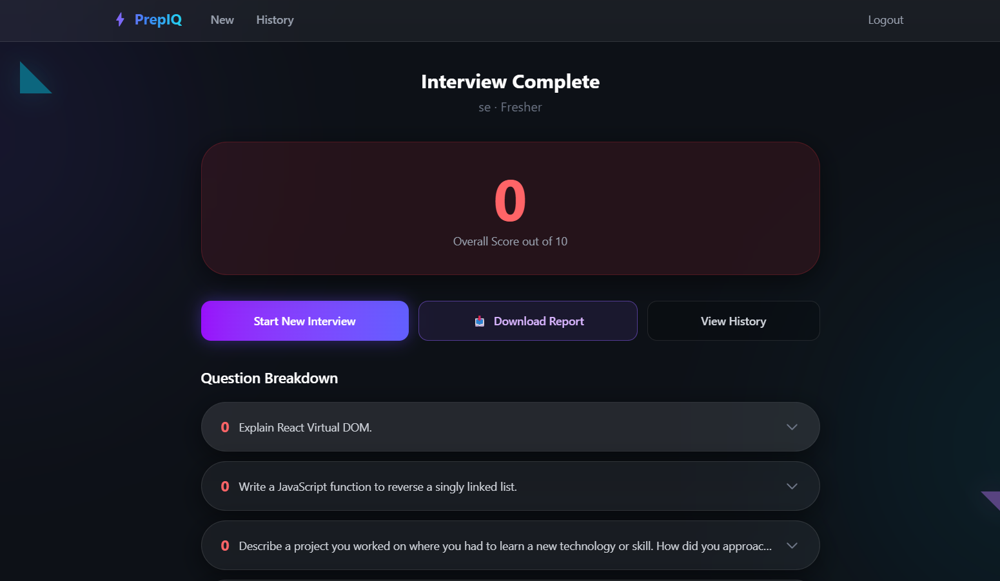

# ⚡ Prepify  

An AI-powered interview preparation platform that generates role-specific questions, evaluates your answers against a strict scoring rubric, and tracks your progress over time.

**Live demo:** [https://prepify-mu.vercel.app/](#)


---

## Why I built this

Most interview prep tools either give generic, repetitive questions or rely on a peer who may not show up. Prepify generates questions tailored to the exact role you're applying for, optionally reads your resume to ask about your actual projects, and gives instant, honest feedback graded against a real evaluation rubric instead of generic praise.

---

## Features

- **Role-aware question generation** — questions adapt to the role, experience level, and an optional job description
- **Resume-aware questions** — upload a PDF resume; half the questions are generated specifically from your projects and skills, half are general role questions
- **Strict AI evaluation** — a scoring rubric that penalizes vague or empty answers instead of giving inflated scores
- **Timed questions** with auto-submit, an optional hint system (costs points), and skip/revisit support
- **Category performance breakdown** — radar and bar charts showing strengths/weaknesses across Technical, Behavioral, System Design, and DSA
- **PDF report export** — download a full interview report after each session
- **Session history** — track all past interviews and score trends
- **JWT authentication** with rate limiting on auth and AI routes to prevent abuse

---

## Tech stack

| Layer | Technology |
|---|---|
| Frontend | React, Vite, Tailwind CSS, Recharts |
| Backend | Node.js, Express |
| Database | MongoDB (Mongoose) |
| AI | Groq API (Llama 3.3 70B) |
| Auth | JWT, bcrypt |
| File parsing | Multer, pdf-parse |
| PDF export | jsPDF |
| Deployment | Vercel (client), Railway (server), MongoDB Atlas |

---

## Architecture



The client communicates with the Express API over a REST interface secured with JWT. The API handles auth, resume parsing, and rate limiting, then delegates question generation and answer evaluation to the Groq API using structured JSON prompts. Sessions, scores, and category breakdowns are persisted in MongoDB Atlas.

---

## How it works

1. **Set up your interview** — choose your role, experience level, number of questions, and optionally paste a job description or upload your resume
2. **Answer in real time** — timed questions with optional hints (at the cost of points) and the ability to skip and revisit
3. **Get scored instantly** — each answer is evaluated against a strict rubric with strengths, gaps, and an ideal-answer summary
4. **Review your performance** — a category breakdown shows where you're strong and where you need work, and you can export the full report as a PDF

---

## Running locally

### Prerequisites
- Node.js 18+
- A MongoDB Atlas connection string
- A free Groq API key from [console.groq.com](https://console.groq.com)

### Setup

```bash
git clone https://github.com/your-username/prepify.git
cd prepify

# Backend
cd server
npm install
cp .env.example .env   # fill in your values below
npm run dev

# Frontend (in a new terminal)
cd client
npm install
npm run dev
```

### Environment variables (`server/.env`)
GROQ_API_KEY=your_groq_key_here

MONGO_URI=your_mongodb_atlas_uri

JWT_SECRET=any_random_secret_string

The client runs on `http://localhost:5173`, the server on `http://localhost:5000`.

---

## Screenshots

| Landing page | Interview screen | Results & breakdown |
|---|---|---|
|  |  |  |

---

## What I'd improve next

- Add streaming responses so questions/feedback render token-by-token instead of waiting for the full response
- Move AI calls to a background queue so the request doesn't block on Groq's response time
- Add support for multiple LLM providers as a fallback if one is rate-limited

---

## License

MIT... feel free to use and modify as you like! If you find any bugs or have suggestions, open an issue or submit a PR. Happy prepping!